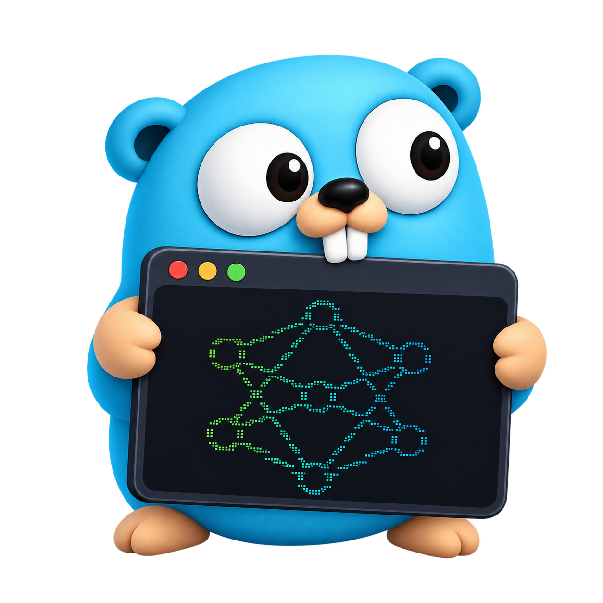
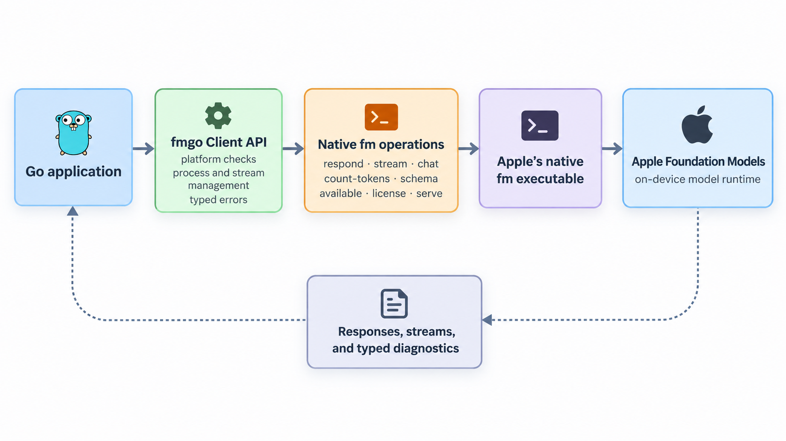

<p align="center">
  
</p>

<h1 align="center">fmgo</h1>

<p align="center">
  A Go interface for Apple's Foundation Models CLI (<code>fm</code>).
</p>

<p align="center">
  <a href="https://pkg.go.dev/github.com/ruanklein/fmgo"></a>
  <a href="LICENSE"></a>
  <a href="https://go.dev/"></a>
</p>

`fmgo` provides an idiomatic Go interface to Apple's native Foundation Models
CLI (`fm`). It executes and manages the native command internally so Go
applications can use Apple's on-device Foundation Model without Swift, cgo, or
private framework bindings.

It is a focused Go library: not a CLI, Apple SDK, Swift bridge, cgo bridge, or
reimplementation of Foundation Models.

~30 KB of production Go source.

## How It Works



`fmgo` builds argument lists, validates the supported platform, manages the
native `fm` process and streaming, translates known diagnostics into Go errors,
and returns responses to the calling application. The Foundation Models runtime
remains Apple's native on-device implementation; `fmgo` does not replace it.

## Features

- Non-streaming and streaming response generation with context cancellation
- Instructions, text segments, image input, transcripts, and conversation resume
- Structured output with local `SchemaFor[T]` generation and `RespondAs[T]`
- Token counting and structured Foundation Model availability results
- Interactive native `fm chat` process/session management
- Native `fm serve` lifecycle management over TCP or Unix sockets
- Typed sentinel errors and diagnostic `CommandError` values

## Requirements

- macOS 27 or later
- Go 1.27 or later
- Apple's native `fm` executable
- Foundation Models available on the machine
- Accepted Foundation Models CLI terms where required

`fmgo.New` returns `ErrUnsupportedPlatform` outside macOS and
`ErrUnsupportedVersion` before macOS 27. Operations return `ErrFMNotFound` when
the native executable cannot be located.

## Installation

```bash
go get github.com/ruanklein/fmgo
```

## Example Project

[`fm-chat`](https://github.com/ruanklein/fm-chat) is a demonstration project
that uses `fmgo` to build an interactive chat application with Apple's native
Foundation Models CLI.

## Quick Start

```go
package main

import (
	"context"
	"fmt"
	"log"

	"github.com/ruanklein/fmgo"
)

func main() {
	client, err := fmgo.New()
	if err != nil {
		log.Fatal(err)
	}

	response, err := client.Respond(context.Background(), fmgo.Request{
		Prompt: "Explain goroutines in one paragraph.",
	})
	if err != nil {
		log.Fatal(err)
	}

	fmt.Println(response.Text)
}
```

## Usage

The examples below assume a previously created `client` and `ctx`.

### Instructions

```go
response, err := client.Respond(ctx, fmgo.Request{
	Prompt:       "Explain channels.",
	Instructions: "Use one concise paragraph.",
})
if err != nil {
	log.Fatal(err)
}
fmt.Println(response.Text)
```

### Streaming

`Stream` owns a native process. Always close it and check its terminal error.

```go
stream, err := client.Stream(ctx, fmgo.Request{
	Prompt: "Write a short story.",
})
if err != nil {
	log.Fatal(err)
}
defer stream.Close()

for stream.Next() {
	fmt.Print(stream.Text())
}
if err := stream.Err(); err != nil {
	log.Fatal(err)
}
```

### Images

Image paths are passed directly to the native `fm` command. `fmgo` does not
process the image itself.

```go
response, err := client.Respond(ctx, fmgo.Request{
	Prompt: "Describe this image.",
	Images: []string{"/path/to/image.png"},
})
if err != nil {
	log.Fatal(err)
}
fmt.Println(response.Text)
```

### Structured Output

`SchemaFor` generates JSON Schema locally from a Go type. `RespondAs` uses that
schema for the request and decodes the JSON response into the same type.

```go
type Person struct {
	Name string `json:"name"`
	Age  int    `json:"age"`
}

schema, err := fmgo.SchemaFor[Person]()
if err != nil {
	log.Fatal(err)
}

response, err := client.Respond(ctx, fmgo.Request{
	Prompt: "Generate a fictional person.",
	Schema: schema,
})
if err != nil {
	log.Fatal(err)
}
fmt.Println(response.Text)
```

```go
person, err := fmgo.RespondAs[Person](ctx, client, fmgo.Request{
	Prompt: "Generate a fictional person.",
})
if err != nil {
	log.Fatal(err)
}
fmt.Println(person.Name)
```

### Token Counting

`CountTokens` returns an integer rather than CLI text. A saved transcript can be
counted with `TokenRequest.Transcript`.

```go
count, err := client.CountTokens(ctx, fmgo.TokenRequest{
	Prompt: "Hello world",
})
if err != nil {
	log.Fatal(err)
}
fmt.Println(count)
```

### Availability

```go
availability, err := client.Available(ctx)
if err != nil {
	log.Fatal(err)
}
for _, model := range availability.Models {
	fmt.Println(model.Model, model.Available, model.Reason)
}
```

### Transcripts and Resume

Transcripts are saved and resumed by the native `fm` functionality.

```go
response, err := client.Respond(ctx, fmgo.Request{
	Prompt:         "Continue the conversation.",
	Resume:         "/tmp/conversation.json",
	SaveTranscript: "/tmp/updated-conversation.json",
})
if err != nil {
	log.Fatal(err)
}
fmt.Println(response.Text)
```

### Interactive Chat

`fm chat` is an interactive native process, not an undocumented structured chat
protocol. `StartChat` exposes its stdin, stdout, and stderr; consume both output
streams, close stdin when finished, then call `Wait` or `Close` to reap it.

```go
session, err := client.StartChat(ctx, fmgo.ChatOptions{
	Instructions: "You are a concise assistant.",
})
if err != nil {
	log.Fatal(err)
}
defer session.Close()
```

### Chat Completions Server

`Serve` manages Apple's native `fm serve` process. It does not implement an HTTP
server or proxy in Go.

```go
server, err := client.Serve(ctx, fmgo.ServerOptions{
	Host: "127.0.0.1",
	Port: 8080,
})
if err != nil {
	log.Fatal(err)
}
defer server.Close()

fmt.Println(server.Addr())
```

Use `Socket` instead of `Host` and `Port` for a Unix domain socket:

```go
socketServer, err := client.Serve(ctx, fmgo.ServerOptions{
	Socket: "/tmp/fm.sock",
})
if err != nil {
	log.Fatal(err)
}
defer socketServer.Close()
```

## Error Handling

Use `errors.Is` for expected operational conditions and `errors.As` for command
diagnostics.

```go
client, err := fmgo.New()
if errors.Is(err, fmgo.ErrUnsupportedPlatform) {
	log.Fatal("fmgo requires macOS")
}
if errors.Is(err, fmgo.ErrUnsupportedVersion) {
	log.Fatal("fmgo requires macOS 27 or later")
}
if err != nil {
	log.Fatal(err)
}

response, err := client.Respond(ctx, fmgo.Request{Prompt: "Hello"})
if errors.Is(err, fmgo.ErrGuardrailViolation) {
	log.Println("the native model rejected the request under its guardrails")
}
var commandErr *fmgo.CommandError
if errors.As(err, &commandErr) {
	fmt.Println(commandErr.ExitCode, commandErr.Stderr)
}
_ = response
```

Known CLI conditions also map to `ErrFMNotFound`, `ErrModelUnavailable`,
`ErrLicenseRequired`, and `ErrGuardrailViolation`. Guardrail classification is
conservative and uses diagnostic markers emitted by the native CLI; inspect
`CommandError.Stderr` when you need the original diagnostic text.

## Platform Scope

`fmgo` intentionally targets Apple's native `fm` command on macOS. It does not
support Linux, Windows, cloud providers, OpenAI, Anthropic, Ollama, or arbitrary
LLM providers.

## Disclaimer

`fmgo` is an independent open-source project and is not affiliated with,
endorsed by, or sponsored by Apple Inc. Apple, macOS, and Foundation Models are
trademarks of Apple Inc. `fmgo` does not distribute Apple's `fm` executable.

## License

Licensed under the [Apache License 2.0](LICENSE).
