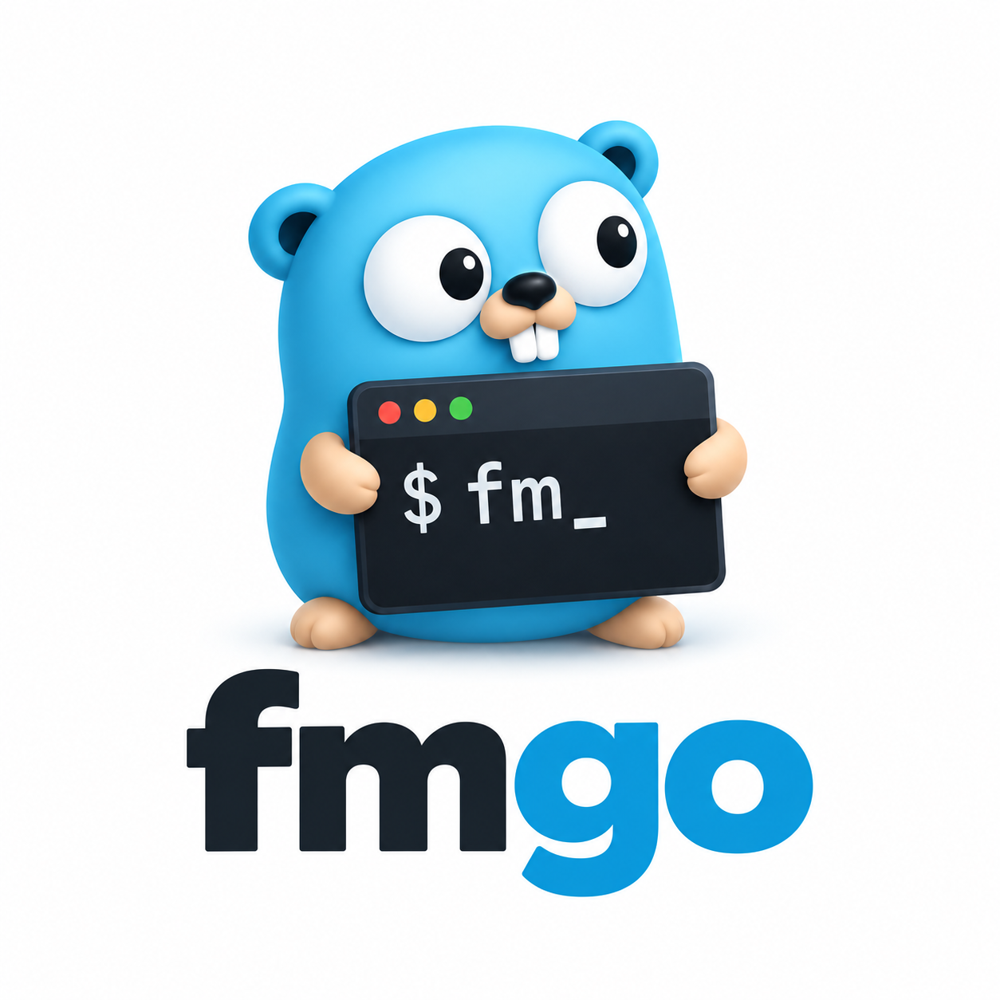

<p align="center">
  
</p>

# fmgo

`fmgo` is a pure Go interface for Apple's Foundation Models CLI (`fm`). It runs
the native executable directly and does not reimplement Foundation Models.

It is not an Apple project or official Apple SDK. It is not a Swift bridge, does
not use or require cgo, does not access private Apple frameworks, and
intentionally provides no CLI of its own.

## Requirements

- macOS 27 or later
- Apple's native `fm` command
- Foundation Models available on the machine
- accepted Foundation Models CLI terms where required

`fmgo.New` returns `ErrUnsupportedPlatform` outside macOS and
`ErrUnsupportedVersion` before macOS 27. A missing `fm` executable is returned as
`ErrFMNotFound` when an operation needs it.

## Examples

```go
client, err := fmgo.New()
if err != nil { /* handle */ }
response, err := client.Respond(ctx, fmgo.Request{
    Prompt: "Explain goroutines.",
    Instructions: "Be concise.",
})
```

```go
stream, err := client.Stream(ctx, fmgo.Request{Prompt: "Write a short story."})
if err != nil { /* handle */ }
defer stream.Close()
for stream.Next() {
    fmt.Print(stream.Text())
}
if err := stream.Err(); err != nil { /* handle */ }
```

```go
response, err := client.Respond(ctx, fmgo.Request{
    Prompt: "Describe this image.",
    Images: []string{"/tmp/photo.png"},
})
```

```go
type Person struct {
    Name string `json:"name"`
    Age int `json:"age"`
}

person, err := fmgo.RespondAs[Person](ctx, client, fmgo.Request{
    Prompt: "Generate a fictional person.",
})
```

```go
count, err := client.CountTokens(ctx, fmgo.TokenRequest{Prompt: "Hello world"})
availability, err := client.Available(ctx)
_ = count
_ = availability
_ = err
```

```go
response, err := client.Respond(ctx, fmgo.Request{
    Prompt: "Continue the conversation.",
    Resume: "/tmp/conversation.json",
    SaveTranscript: "/tmp/updated-conversation.json",
})
```

```go
server, err := client.Serve(ctx, fmgo.ServerOptions{Port: 8080})
if err != nil { /* handle */ }
defer server.Close()
```

`cmd/respond`, `cmd/stream`, `cmd/structured`, and `cmd/server` contain
compilable versions of these integrations.

## Notes

`fmgo` never invokes `sudo`, accepts license terms, changes Apple's guardrails,
logs prompts, or constructs shell commands. `ChatSession` deliberately exposes
the native interactive process streams instead of inventing a message protocol.
